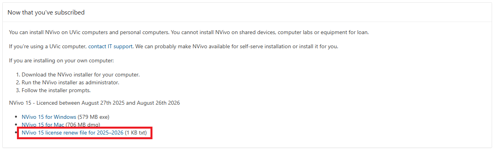
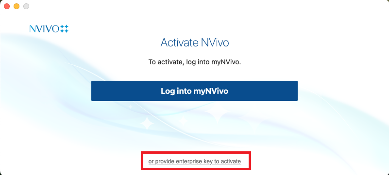

## Pre-Workshop Videos & Activities
This workshop is primarily hands-on practice with NVivo in order to learn to use key features of the software. To participate fully please do the following **before the workshop**:

- **REQUIRED:** Install NVivo on your computer:
  - If you are a UVic graduate student, faculty member, or staff, you can download the software and the license file from **Online Services** (link is provided in the approval email from the UVic Computer Help Desk). Once you receive confirmation of approval for the license, log in to Online Services, download the Mac or Windows version of the software, and retrieve the license file, which contains the license code, from the Online Services website.
    
  After installing NVivo, open the software and choose **“or provide enterprise key to activate”**. Enter the license code from your license file to complete the activation.
    
  **-OR-**  
  - You can download an NVivo trial version by [following this link](https://lumivero.com/resources/free-trial/nvivo/){:target="_blank"}  

- **OPTIONAL:** [Introduction to NVivo](https://www.youtube.com/watch?v=QNjEygXM_bE){:target="_blank"} video (7 min) 
<iframe width="560" height="315" src="https://www.youtube.com/embed/QNjEygXM_bE" title="YouTube video player" frameborder="0" allow="accelerometer; autoplay; clipboard-write; encrypted-media; gyroscope; picture-in-picture" allowfullscreen></iframe>

[NEXT STEP: Introduction to Hands-On Activities](activities-intro.html){: .btn .btn-blue }
