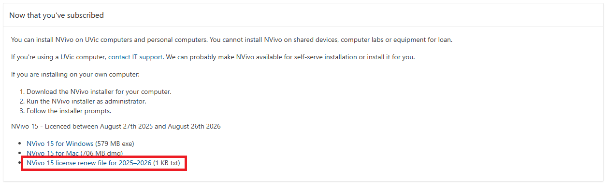
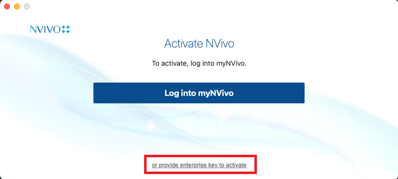

## Pre-Workshop Videos & Activities
This workshop is primarily hands-on practice with NVivo in order to learn to use key features of the software. To participate fully please do the following **before the workshop**:

- **REQUIRED:** Install NVivo on your computer:
  - You can download an NVivo trial version by [following this link.](https://lumivero.com/resources/free-trial/nvivo/){:target="_blank"}  
 **-OR-**  
  - If you are UVic faculty, a graduate student, or another eligible researcher, you can request [access to NVivo](https://www.uvic.ca/systems/services/pages/analytics-and-bi.php#ipn-nvivo) through the [Online Services Portal](https://onlineservices.uvic.ca/). After requesting for the license, you can download the software and access the license information through the Manage Your Services page.
    
  After installing NVivo, open the software and choose **“or provide enterprise key to activate”**. Enter the license code from your license file to complete the activation.
    

- **OPTIONAL:** [Introduction to NVivo](https://www.youtube.com/watch?v=QNjEygXM_bE){:target="_blank"} video (7 min) 
<iframe width="560" height="315" src="https://www.youtube.com/embed/QNjEygXM_bE" title="YouTube video player" frameborder="0" allow="accelerometer; autoplay; clipboard-write; encrypted-media; gyroscope; picture-in-picture" allowfullscreen></iframe>

[NEXT STEP: Introduction to Hands-On Activities](activities-intro.html){: .btn .btn-blue }
